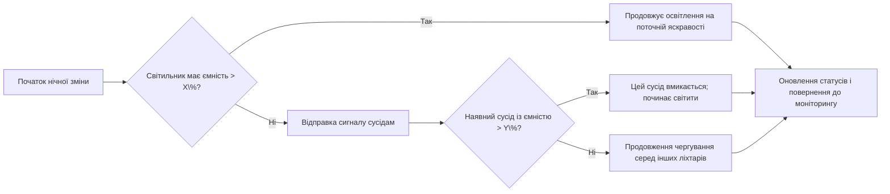
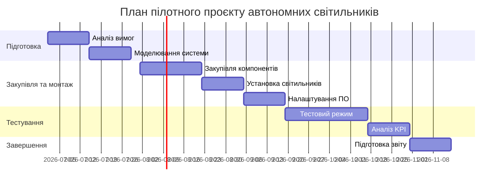

# Виконавче резюме  
Автономні сонячні світильники з вбудованими батареями вже застосовуються у світі для забезпечення освітлення під час відключень та підвищення надійності інфраструктури. Такі рішення (напр. проекта «Solar Urban Hub» в ЄС) поєднують у собі панелі, світлодіодну лампу, контролери й акумулятори в єдиному пристрої. Практика показує: міста встановлюють сотні «SmartLights» (Fonroche у США) для швидкого відновлення освітлення після аварій; на невеликих островах (Греція) автономні «SunStay» світильники дали 365 ночей світла без мережі. Пристрої з LiFePO4–батареями на 2+ доби автономності, MPPT-контролерами та оптичними датчиками забезпечують освітлення навіть у хмарну погоду. Зв’язок між світильниками організують через LoRaWAN, Zigbee або NB-IoT (див. розділ “Протоколи”). Алгоритми енергоменеджменту включають динамічне керування яскравістю («Anti-BlackOut») та розподіл навантаження (напр. оптимізація PSO для профілів димування). У цьому звіті наведено огляд реальних кейсів, опис архітектури та компонентів, порівняння протоколів, технічні розрахунки (ємність батарей, час автономії тощо для помірного й південного клімату), схеми управління роїв, аспекти безпеки й регулювання, а також рекомендації з апаратури, алгоритмів і плану пілотного проєкту. 

## 1. Світова практика та реальні кейси  
По всьому світу спостерігається зростання впровадження офлайн-світильників для підвищення стійкості мережі освітлення. У проєкті EU «Solar Urban Hub» (розробник SIARQ) створено автономний «хаб» з куполоподібним сонячним модулем, батареями, LED-світлом і сенсорами – повністю автономну IoT-платформу. Цей хаб передає дані через хмару, що дозволяє моніторити та дистанційно керувати світильником (включати/вимикати). Пілоти уже тривають у Іспанії та готуються в Копенгагені.  
У США компанія Fonroche Lighting розгорнула сотні автономних «SmartLights» у Лос-Анджелесі, Луїсвіллі (Кентуккі) і Форт-Ворті (Техас). Ці системи без кабелю і прокладки використовувалися як масштабне рішення у відповідь на викрадення мідних дротів та застарілу мережу. У Лос-Анджелесі перехід на сонячні вуличні світильники повністю усунув проблему крадіжок проводів та забезпечив 365 ночей світла на рік. У Луїсвіллі міські служби замінювали сотні рутинних вуличних світильників на автономні (до 10 шт. інсталяцій на день), без очікування дозволів чи траншей. У Форт-Ворті сонячні світильники встановлювалися в історично недофінансованих районах, де не було інфраструктури – без жодних ліній чи затримок. Усі три кейси показали: автономні сонячні системи встановлюються швидше, знижують ризики (викрадення, збої) і розширюють доступ до безпечного освітлення там, де традиційна мережа не справляється.  
Подібні рішення застосовуються і в Африці. Наприклад, в Нігерії використання сонячних світильників покращує доступність енергії і безпеку під час аварійних відключень. За даними EngoPlanet, в умовах **5–7 годин сонячного випромінювання** енергозбереження акумуляторів дозволяє забезпечити **2+ доби автономії** освітлення. Це критично під час нестабільності мережі: світильники не залежать від дії мережі та однаково світять у сонячні чи похмурі дні.  
Отже, практика доводить ефективність повністю автономних світильників: вони служать mini-«генераторами», що підтримують інфраструктуру під час віялових відключень, скорочують експлуатаційні витрати та гарантують базову безпеку мешканців навіть без мережі. Інтегровані сенсори та зв’язок відкривають додаткові можливості для розумного управління освітленням.

## 2. Архітектури та апаратні компоненти системи  
Типова конструкція автономного вуличного світильника включає в себе: сонячну панель, **батарею**, контролер заряду, LED-лампу з драйвером, корпус зі скріпленою електронікою, а також комунікаційний модуль і сенсори. Основні компоненти та їх характеристики:  

- **Сонячні панелі:** зазвичай застосовують монокристалічні кремнієві модулі високої ефективності (15–22 %). Панель підбирається виходячи з необхідної потужності освітлення й очікуваних сонячних годин. Для помірного клімату може вистачити панелі 100–200 Вт для однієї автономної лампи, у південному – можна зменшити потужність або забезпечити більшу надлишковість. Важливо передбачити регульоване кріплення (нахил) для оптимізації збору сонячної енергії.  
- **Батареї:** критичний елемент для автономної роботи. Сучасні системи переважно використовують літій-залізо-фосфатні (LiFePO₄) батареї, які мають довгий ресурс циклів, стабільну роботу при різких температурах і безпеку. Наприклад, професійні вироби для вуличних світильників вказують: LiFePO₄ «виявилися оптимальним вибором завдяки своїй виключній довговічності, безпеці та ефективності». Альтернативою можуть бути NiMH або свинцеві батареї, але вони мають менший ресурс та швидше деградують при глибоких розрядах. У таблиці нижче наведено порівняння основних типів акумуляторів:

  | Тип батареї          | Енергетична щільність | К-ть циклів        | Робочі температури     | Переваги / недоліки             |
  |---------------------|-----------------------|--------------------|-----------------------|---------------------------------|
  | LiFePO₄ (литій-іон) | Висока (110–160 Вт·год/кг) | 2000–5000 (до 80 % SOC) | –20…+60 °C (широкий діапазон) | Висока ціна, легка вага, довгий ресурс |
  | NiMH                | Середня (60–100 Вт·год/кг)  | ~1000–2000        | –10…+50 °C            | Менша вартість, але вища саморозрядність     |
  | Свинцево-кислотні   | Низька (30–50 Вт·год/кг)   | ~500–1000         | 0…+40 °C            | Дешеві, але важкі і короткоживучі           |

- **Світлодіодні лампи і драйвери:** звичайно застосовують LED-модулі 30–100 Вт (залежно від вимог до освітленості) з яскравістю до 130–170 лм/Вт. Драйвери мають бути ефективними (>90%) і сумісними з зовнішнім живленням. У багатьох комерційних ліхтарях драйвер інтегрований з контролером заряду й мікропроцесором. Опція – датчики руху чи освітленості, щоб динамічно знижувати потужність увімкнення (функція Anti-BlackOut та вбудований PIR-датчик).
- **Контролери заряду та інвертори:** для управління зарядом батарей використовується MPPT-контролер, що підвищує ефективність перетворення енергії панелі на акумулятор. Інвертор потрібен, якщо система видає змінний струм (для живлення перемінного навантаження); часто ж LED-лампа працює від постійного струму, тому достатньо DC–DC перетворювачів.  
- **Комунікаційні модулі:** забезпечують зв’язок між світильниками та з центральною системою. Залежно від обраної мережі це можуть бути LoRaWAN-модулі, Zigbee-модулі, NB-IoT/4G-модеми тощо (детальніше – у розділі 3).  
- **Інше обладнання:** корпус зі ступенем захисту не менше IP65, система кріплення на стовпі, оптичні розсіювачі. Деякі системи пропонують рішення безконтактної передачі енергії (індуктивний роз’єм між ліхтарями), але це малорозповсюджена опція через втрати та складність.  

Таким чином, апаратна архітектура передбачає повністю незалежний вузол світильника: панель постачає енергію на контролер і батарею вдень, батарея живить лампу вночі; контролер з мікропроцесором ідейно забезпечує оптимальне розподілення енергії, враховуючи заряд батареї (наприклад, динамічно змінюючи яскравість – функція «Anti-BlackOut»).  

## 3. Комунікаційні протоколи для мережі світильників  
Для організації ройових систем необхідно з’єднати світильники в мережу. Поширені варіанти протоколів – це **LoRaWAN**, **Zigbee** (IEEE 802.15.4) та **NB-IoT/CAT1**:  
- **LoRaWAN:** LPWAN-протокол з дальністю до 2–5 км на відкритому просторі. Один шлюз LoRa може обслуговувати 100–120 вузлів. Переваги: дуже мале енергоспоживання, низькі витрати на SIM (достатньо одного шлюзу), простота масштабування. Недолік – потреба в «шлюзі» з доступом в Інтернет та можливе заглушення сигналу в щільній забудові.  
- **Zigbee (Mesh):** мережевий протокол для короткої відстані (діапазон ≈150 м між вузлами за умов прямої видимості), але з можливістю ретрансляції через інші світильники (mesh-топологія). Дає високу надійність у міських умовах і не потребує мобільного зв’язку. Основний недолік – менша дальність і необхідність додаткових проміжних вузлів (рекомендовано ставити реле кожні ~35 м, що забезпечує радіус дії ≈1.5 км).  
- **NB-IoT / LTE Cat1:** протоколи мобільного зв’язку, що підключають кожний світильник напряму до базової станції оператора. Переваги – широкий покриття, висока надійність, відсутність необхідності встановлення локальних шлюзів. Недоліки – потреба SIM-карт і регулярної абонплати; споживання енергії більше, ніж у LoRa/Zigbee.  
- **Інші варіанти:** Wi-Fi або GPRS використовують рідше через високу потужність або витрати. У деяких прототипах застосовують спеціальні mesh-протоколи для IoT.  

Незалежно від вибору, всі рішення передбачають централізований пункт управління (контролер/сервер), який збирає дані з ліхтарів і передає команди. Як резюмує галузевий огляд, LoRaWAN підходить для середніх і великих відстаней з мінімальними витратами, тоді як Zigbee – для локальних сіток з багатьма вузлами, а NB-IoT – коли потрібен глобальний охват за рахунок мобільних мереж. Таблиця порівнянь протоколів:

| Протокол        | Дальність зв’язку   | Топологія         | Енергоспоживання | Коментар                                 |
|-----------------|---------------------|-------------------|------------------|------------------------------------------|
| LoRaWAN         | 1–5 км (місто/сіль) | Зіркоподібна (через шлюз) | Дуже низьке    | Не потребує багато шлюзів; широка зона покриття |
| Zigbee (Mesh)   | ≈150 м між вузлами  | Mesh (ретрансляція)   | Дуже низьке    | Гнучка мережа, дешеві модулі, потрібно багатошарова топологія |
| NB-IoT / LTE-Cat1 | до десятків км     | Клієнт–сервер через мобіл. мережу | Високе      | Широке покриття операторів, без дод. обладнання |
| Wi-Fi / GPRS    | 50–100 м            | Адаптивна (точка доступу) | Помірне/високе | Енерговитратне, використовують при готовій мережі |

## 4. Алгоритми чергування та співпраці в роєві  
Головне завдання «ройової» системи – координувати використання обмеженої акумуляторної енергії між кількома світильниками. Наприклад, коли у одного світильника батарея сідає, він подає сигнал іншому, щоб той увімкнувся (і навпаки). Така логіка може реалізовуватися за різними сценаріями:  

- **Централізоване управління:** існує головний контролер (або лідер в роєві), який отримує інформацію про рівні заряду з усіх світильників і вирішує, який з них повинен світити в даний момент. Цей підхід спрощує реалізацію пріоритетів (наприклад, головна дорога, критичні пункти інфраструктури) та відновлення після збоїв, але вимагає надійного зв’язку з усіма вузлами.  
- **Децентралізоване (peer-to-peer):** кожний світильник самостійно оцінює свою залишкову ємність і обмінюється короткими повідомленнями з сусідами, домовляючись про чергу ввімкнення. Наприклад, застосовується правило: «якщо твоя батарея <20 % заряду, пошли запит сусідам; якщо хтось інший може, він вмикається». Такі алгоритми менш схильні до одиночних точок відмови, але вимагають складніших протоколів консенсусу.  
- **Оптимізаційні методи:** у наукових роботах пропонувались евристики й алгоритми пошуку рішення для мінімізації енергоспоживання, наприклад, частинчаста рійова оптимізація (PSO). У Smart Street Lighting PSO застосовували для оптимального регулювання димування набору світильників під заданий профіль яскравості. Хоча це стосується контурів регулювання, подібні методи можна адаптувати для алгоритму чергування – ставлячи задачу мінімізувати витрати енергії при покритті необхідного освітлення.  
- **Пріоритети та відновлення:** доцільно закласти в алгоритм відновлення вихідного стану після появи напруги мережі (тобто повертати стандартний режим), а також визначати пріоритети (наприклад, головні магістралі мають світити довше).  

Нижче приведена спрощена блок-схема алгоритму чергування в децентралізованому рої:

Коли батарея опускається нижче критичного порогу, світильник відправляє запит сусідам (якщо є зв’язок), і один з них переходить в аварійний режим. Процес повторюється у циклі, забезпечуючи нескінченну «передачу естафети» енергії (роєве чергування).  

## 5. Технічні розрахунки автономності та ефективності  
Для оцінки необхідних параметрів системи розраховуємо ємність батарей і генерацію сонячної енергії для типового перехрестя. Приклад: **перехрестя з 4 світильниками**, кожен 50 Вт (LED), працюють 10 годин на добу у режимі аварійного включення (середнє навантаження, коли «естафету» несуть по черзі). Якщо в кожен момент освітлена тільки одна лампа (економний режим рою), то денна потреба ≈0.5 кВт·год (50 Вт⋅10 год). Для двох діб автономії потрібно ~1.0 кВт·год запасу.  

- **Панель:** в помірному кліматі (наприклад, Київ, ~4 пікові години сонця) сонячна панель ≈200 Вт виробляє ~0.8 кВт·год/день. У південному кліматі (~6 год) – ~1.2 кВт·год/день. Тобто у помірному регіоні 200‑ватна панель майже покриває 0.5 кВт·год споживання, забезпечуючи дві доби автономності при суміщеному балансові.  
- **Батарея:** з урахуванням втрат (контролер, інвертор ≈10 %) номінальна ємність 1.2–1.5 кВт·год на приклад вище. Наприклад, літієвий батарейний блок 48 В×25 А·год ≈1.2 кВт·год. Це дає близько 24 години роботи одного світильника 50 Вт. При двох світильниках у «рію» (чередуванні) навантаження ділиться, тому подібний акумулятор витримає якраз ~2 доби.  
- **Втрати:** втрати на передачу між світильниками (якщо передбачається провідний зв’язок) мінімальні (кілька %). Індуктивна передача (якщо колись буде) може мати втрати ~10–20%. Але в описаних системах «мікро-мережі» світильники зазвичай не фізично передають потужність один одному — вони лише передають сигнал, а кожен світить від свого акумулятора, тому втрати прямої передачі можна не враховувати.  

Наведемо прикладні результати в таблиці:

| Климат          | Панель (Вт) | Енергія/день (кВт·год) | Батарея (кВт·год) | Автономія (ночей) |
|-----------------|-------------|-------------------------|-------------------|-------------------|
| Помірний (4 год) | 200         | ≈0.8                    | ≈1.2              | 2 (≈2 доби)        |
| Сонячний (6 год) | 150         | ≈0.9                    | ≈1.0              | 2                |

Ці розрахунки ілюструють, що з правильно підібраною батареєю і панеллю система може світити без підзарядки дві-три ночі, як це підтверджує практика (EngoPlanet: ≥2 дні автономії). В умовах дуже слабкої інсоляції (північ, зимовий період) для тієї ж потужності знадобляться значно більші батареї, або гібридний режим (дублювання від мережі).

## 6. Централізована vs децентралізована організація рою  
При побудові рою світильників виникає питання: чи є єдиний керуючий орган, чи кожен вузол вирішує сам.  

- **Централізований рій:** один контролер або світильник призначається «лідером». Він отримує дані від усіх решти через мережу, обирає наступний активний вузол та наказує йому вмикнутися/вимкнутися. Переваги: можна реалізувати складні критерії (наприклад, черговість на основі пріоритетів зон) та швидко реагувати на зміни (одне рішення – і всі світильники виконують). Недоліки: якщо лідер виходить з ладу, рій може втратити координацію; вимагає стійкого зв’язку з центральним вузлом.  
- **Децентралізований рій:** немає єдиного центру. Кожен світильник самостійно вирішує, коли йому вмикатися, спираючись на сигнали від сусідів (використовується ad-hoc протокол). Підхід більш живучий: падіння одного вузла не зупиняє всю систему, оскільки інші можуть домовитися між собою. Водночас, щоб усі узгодились, потрібні узгоджені правила та, можливо, алгоритми консенсусу (щоб не було водночас двох активних вузлів, якщо це небажано).  
- **Міксований підхід:** можна комбінувати – наприклад, призначити тимчасового лідера на випадок збою мережі; або під час аварії діяти децентралізовано, а після поновлення напруги повернутися до централізованого менеджменту мережі.  

Сигналізація в рої може відбуватись на тому ж каналі, що і сенсори. Наприклад, ліхтар надсилає «SOS»-повідомлення у LoRaWAN мережу, і сусіди, які приймають його, починають свою чергу. Важливо також передбачити механізм виявлення відновлення електромережі, щоб після відновлення живлення повернутися до нормального режиму та коректно поповнити батареї.

## 7. Ризики, безпека та нормативи  
При впровадженні автономних світильників слід звернути увагу на низку питань відповідальності, стандартів і безпеки. 

- **Електробезпека та пожежна безпека:** акумулятори Li-ion/LiFePO₄ повинні бути сертифіковані за стандартами (наприклад, IEC 62619 для промислових акумуляторів), мати захист від короткого замикання та перенавантаження. Світильники потрібно монтувати з дотриманням правил електробезпеки (заземлення, захист від випадкового контакту).  
- **Захист від зловмисних дій:** оскільки світильники працюють в автономному режимі, можливі загрози від хакерських атак на мережу. Треба забезпечити шифрування зв’язку (напр., LoRaWAN підтримує AES-128), а критичні команди обробляти надійними контролерами. Резервні алгоритми (fallback-режими) повинні запобігати помилковому спрацьовуванню.  
- **Регулювання та сертифікація:** компоненти мають мати відповідні сертифікати (CE, UL тощо). Корпус світильника повинен відповідати міжнародним стандартам люмінаріїв (наприклад, IEC 60598). Сонячні панелі – IEC 61215/61730, інвертори – IEC 62109/62116. Для гібридних систем варто врахувати вимоги мережевих codes (IEEE 1547, EN 50549 при підключенні до зґуртованих мереж).  
- **Нормативи якості світла:** необхідно дотримуватися стандартів освітленості (наприклад, EN 13201 для вуличного освітлення), особливо у режимах аварійного світла. У разі джерела з батареї слід перевірити, що рівні LUX відповідають нормам на автошляхах і перехрестях.  
- **Відповідальність за роботу:** за встановлення та обслуговування автономних світильників має нести відповідальність уповноважена організація (зазвичай місцева влада або муніципальне підприємство). У договорі слід зазначити зону відповідальності за аварійне живлення (наприклад, чи надаватимуть служби батареї технічну підтримку, чи відповідають за збій зв’язку тощо).  

## 8. Рекомендації та план пілотного проєкту  
**1. Обладнання:** рекомендується використовувати світлодіодні світильники з інтегрованою панеллю та LiFePO₄-акумулятором ємністю ~1–2 кВт·год (для покриття 1–2 ночей автономії). Наприклад, блок 48 В·25 А·год. Контролер – MPPT, щоб максимізувати збір енергії. Для комунікації – LoRaWAN-модуль (через його дальність і низьку вартість обслуговування). Резервний канал – NB-IoT (якщо у місцевого оператора є покриття).  
**2. Алгоритми:** впровадити адаптивну схему чергування: наприклад, ліхтар з батареєю >30 % світить при максимумі яскравості, коли запас опускається <30 % – він поступово знижує інтенсивність (Anti-BlackOut). Якщо батарея впаде до ~10 %, світильник відправить сигнал наступному («почекай, в мене мало енергії»), і чергування передасться далі. Важливо задати чіткі пороги і алгоритм пріоритету (зазвичай, за порядком ліхтарів на перехресті чи важливістю смуг).  
**3. Протоколи:** стартовим варіантом може бути LoRaWAN з одним шлюзом на вулицю/перехрестя (покриває до 100 вузлів на площі). Zigbee обрати, якщо мережа щільна (багато ліхтарів один від одного ~30–50 м). NB-IoT використовувати як резервну лінію зв’язку (наприклад, для моніторингу) або там, де немає LoRa.  
**4. Етапи пілота:**  
  - Аналіз вимог і моделювання (1–2 тижні): визначити потужність ламп і необхідні компоненти, провести розрахунки автономності (як у попередньому розділі).  
  - Підбір й закупівля обладнання (2–4 тижні): вибір постачальників сонячних панелей, батарей, контролерів та світильників; закупівля комунікаційних модулів.  
  - Монтаж та налаштування (1–2 тижні): встановлення світильників на обраному перехресті чи ділянці, з’єднання в мережу, налаштування порогів і алгоритмів керування.  
  - Тестовий період (4 тижні): перевірка роботи в умовах реальних відключень (моделювання сценаріїв), збір даних (напруга в батареї, час роботи світла, реакція алгоритму). Визначення KPI: наприклад, час безперервного освітлення у режимі рою, частка ночей, які світильники протрималися без мережі.  
  - Оцінка результатів та масштабування: аналіз зібраної статистики, корекція алгоритмів, підготовка звіту.  

Нижче наведено орієнтовний графік впровадження (таймлайн):  

**Таблиця бюджету (пілот на 4 світильники):**

| Стаття витрат          | Кількість | Од. вартість, $ | Загалом, $ |
|------------------------|-----------|------------------|------------|
| LED-світильник 50 Вт   | 4 шт      | 250              | 1000       |
| Сонячна панель 200 Вт  | 4 шт      | 300              | 1200       |
| LiFePO₄ батарея 1.2 кВт·год | 4 шт | 500              | 2000       |
| MPPT контролер         | 4 шт      | 100              | 400        |
| LoRaWAN модулі         | 4 шт      | 50               | 200        |
| Індивідуальні кріплення та дроти | 4 | 50          | 200        |
| Монтажні роботи та ПЗ  | –         | –                | 2000 (орієнт.) |
| **Разом (прибл.)**     | –         | –                | ≈7000–8000  |

Ці приблизні цифри залежать від цін постачальників та курсу, але дають уявлення про масштаб. Важливо включити витрати на роботу інженерів (налаштування, тестування). KPIs пілоту можуть бути: **% ночей з безперебійним світлом**, **час на висвітлення під час відключення**, **споживання акумулятора на ніч**, **витрати на встановлення/ночі**.

**Порівняльна таблиця основних технологій і сценаріїв бюджету:**  

| Компонент/Технологія  | Головна властивість                   | Переваги                  | Приклади вартості   |
|-----------------------|---------------------------------------|---------------------------|--------------------|
| **LiFePO₄ акумулятор** | Високий ресурс циклів і стабільність | Не перегрівається, довговічний | ~$500 за 1 кВт·год |
| NiMH акумулятор       | Проста технологія                     | Недороги, морозостійкі   | ~$200 за 1 кВт·год |
| LED 50 Вт лампа       | Висока ефективність світла            | Енергоощадна (до 165 лм/Вт) | ~$250/шт          |
| LoRaWAN протокол      | Далекий радіус дії (до 2–5 км) | Низьке енергоспоживання | $50 за модуль     |
| Zigbee мережа         | Mesh-з’єднання, мультивузлова         | Гнучке масштабування      | $10 за модуль     |
| NB-IoT модем          | Використання мобільної мережі | Широке покриття           | ~$20 за модуль + SIM |

Наведені таблиці і діаграми допоможуть оцінити найкращі компоненти та технології для проєкту. На їх основі можна прийняти обґрунтовані рішення щодо вибору обладнання, алгоритмів і розподілу бюджетних ресурсів. 

**Джерела:** У звіті використані відкриті ресурси та офіційні джерела: технічні статті та блоги виробників (Signify, Sunna Design, Fonroche), наукові огляди (MDPI), дослідження оптимізаційних алгоритмів, а також приклади впровадження від EngoPlanet. Всі розрахунки наведені з припущенням «типових» навантажень і кліматичних умов; якщо дані відсутні, робилися явно вказані оцінки.